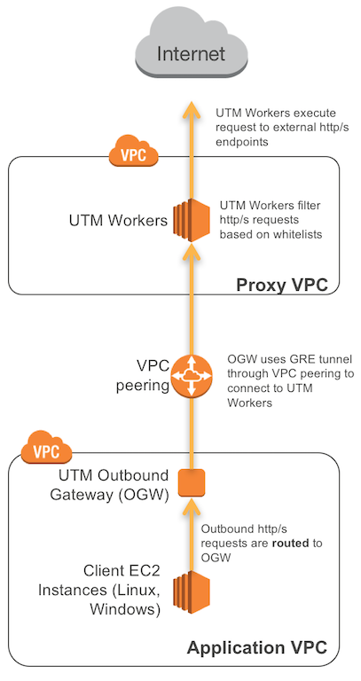
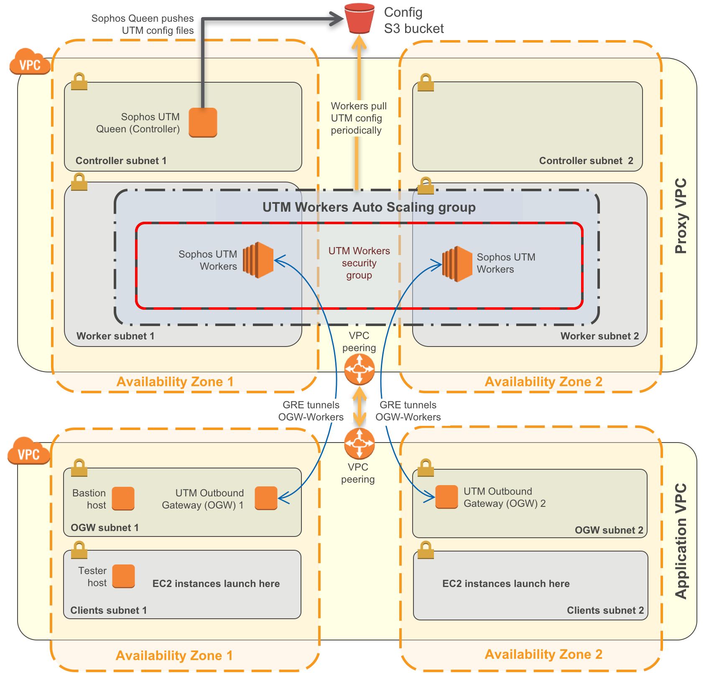

## Sophos Outbound Web Proxy on the AWS Cloud

For additional information and step by step instructions please reference [the quick start guide for this solution](https://docs.aws.amazon.com/quickstart/latest/<guide>/).

### Overview
This solution utilizes the Sophos UTM virtual appliance to provide a transparent outbound proxy for EC2 instances deployed in Amazon Virtual Private Cloud (VPC). In addition, it uses a Sophos feature called Outbound Gateway to extend the security of the solution to multiple VPCs.

AWS EC2 instances often require access to external resources such as software repositories and web services. Many organizations require restricting connections to the Internet to authorized web sites. Web filtering proxies are commonly used to enforce web policies for Internet access.

### High Level Diagram

### Detailed Diagram

